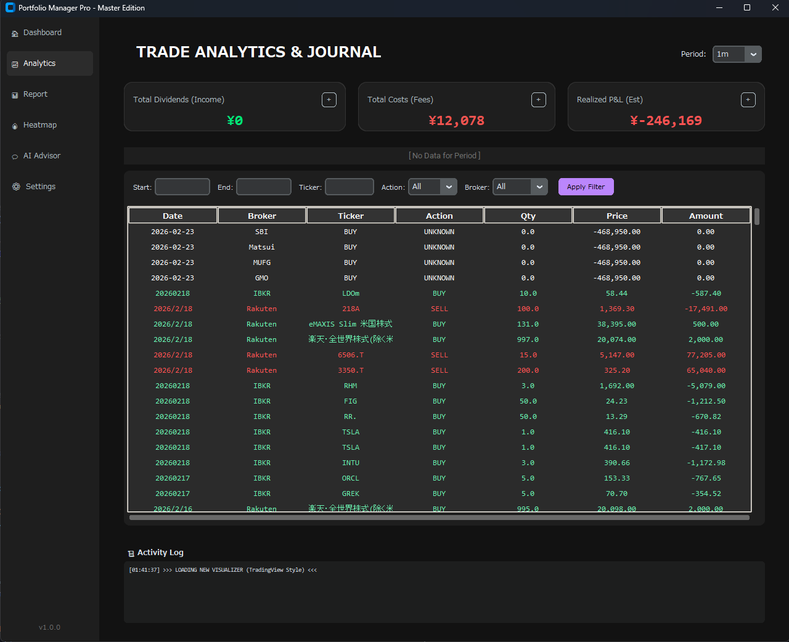

# ANALYTICS — トレード分析・履歴

投資の成果（配当やコスト）の確認と、過去の取引履歴の振り返りを行う画面です。

---

## 主な機能と動作

### Period Selector（期間選択）

1週間、1ヶ月、年初来など、分析対象の期間を素早く切り替えます。

`custom` を選べばカレンダーから任意の日付範囲を指定できます。

| プリセット | 対象期間 |
|---|---|
| 1W | 直近1週間 |
| 1M | 直近1ヶ月 |
| YTD | 年初来 |
| custom | カレンダーで自由に指定 |

---

### Trade Journal（取引履歴）

過去の取引を一覧表示します。以下の条件で細かく絞り込み検索が可能です。

- **期間** — 表示する取引期間を指定
- **ティッカーシンボル** — 特定の銘柄に絞り込み
- **アクション** — `BUY` / `SELL` / `DIV`（配当）から選択
- **証券会社（Broker）** — 口座ごとにフィルタリング

!!! info "活用ポイント"
    期間・銘柄・アクションを組み合わせることで、特定の取引だけをピンポイントで確認できます。配当（DIV）のみ抽出して、受取配当金の推移を振り返ることも有効です。
