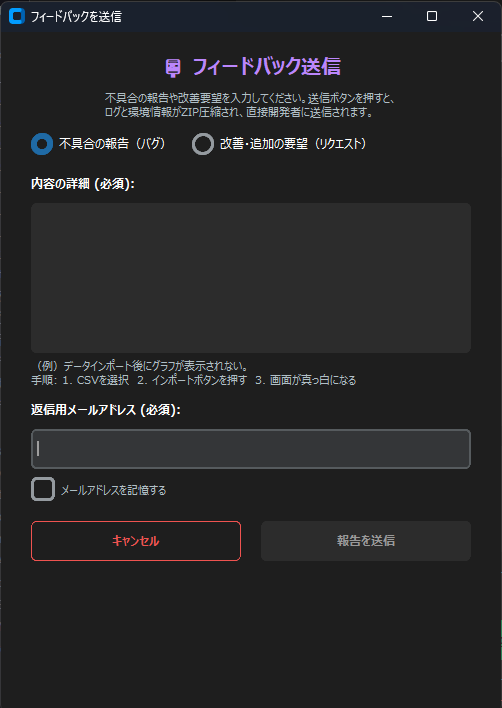

# SETTINGS — 設定・データソース管理

アプリの根幹となる **API キーの設定や、表示形式の管理**を行う画面です。

---

## 主な機能と設定手順

### 各種 API 設定欄

以下の API キーや連携情報を入力します。

| 設定項目 | 用途 |
|---|---|
| **Gemini API** | REPORT の AI 要約・ADVISOR の AI 対話機能で使用 |
| **IBKR（インタラクティブ・ブローカーズ）** | IBKR 口座のデータ自動連携 |
| **Saxo Bank** | Saxo Bank 口座のデータ自動連携 |

---

### Data Sources (Brokers) スイッチ

対応している国内外の証券会社の一覧です。あなたが利用している証券会社のスイッチをオンにしてください。

!!! note "反映先"
    ここでオンにした証券会社だけが、HOME 画面の「**API Data Download**」やインポート画面の選択肢として表示されるようになります。

---

### Save All Settings

変更した設定をすべて保存します。

!!! warning "必ず保存を"
    API キーの入力や証券会社のオンオフを切り替えた後は、**必ず「Save All Settings」をクリック**して設定を確定させてください。

---

## SETTINGS から開けるサブ画面

### ④ フィードバック送信（サポートダイアログ）

サブ画面

SETTINGS 画面の「**Direct Bug Report**」ボタンから呼び出せる、開発者へ直接メッセージを送るための専用画面です。

**使い方**

1 報告の種類をラジオボタンで選択します。

- **不具合の報告（バグ）** — 計算が合わない等のトラブル時
- **改善・追加の要望（リクエスト）** — 新しい機能が欲しい等のアイデア

2 詳細内容と返信用メールアドレスを入力します。

3 送信ボタンを押します。

!!! info "自動ログ添付"
    不具合報告の場合は、問題解決に役立つ内部のログファイルも**自動的に暗号化されて添付**されます。開発者の管理システムへ直接データが届きます。
